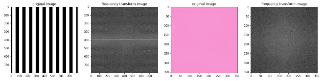

<h1 color:Blue align="center">:books:Fourier-Transformation(Computer Vision):book: :signal_strength: </h1>
<div id="header" align="center">
  
</div>

When we work in image processing, Fourier transform is an important image processing tool which is used to decompose an image into the frequency domain. the input image of the Fourier transform is the spatial domain(x,y) equivalent. the output of the Fourier transform represents the image in the frequency domain.

In the frequency domain image, each point represents a particular frequency contained in the spatial domain image. if an image has more high-frequency components (edges, stripes, corners ), there will be a number of points in the frequency domain at high-frequency values.

example:

```bash
import numpy as np
import matplotlib.pyplot as plt
import cv2
%matplotlib inline
# Read in the images
image_stripes = cv2.imread(‘images/stripes.jpg’)
# Change color to RGB (from BGR)
image_stripes = cv2.cvtColor(image_stripes, cv2.COLOR_BGR2RGB)
# Read in the images
image_solid = cv2.imread(‘images/pink_solid.jpg’)
# Change color to RGB (from BGR)
image_solid = cv2.cvtColor(image_solid, cv2.COLOR_BGR2RGB)
# Display the images
f, (ax1,ax2) = plt.subplots(1, 2, figsize=(10,5))
ax1.imshow(image_stripes)
ax2.imshow(image_solid)
```


```bash
# convert to grayscale
gray_stripes = cv2.cvtColor(image_stripes, cv2.COLOR_RGB2GRAY)
gray_solid = cv2.cvtColor(image_solid, cv2.COLOR_RGB2GRAY)
# normalize the image color values from a range of [0,255] to [0,1] 
norm_stripes = gray_stripes/255.0
norm_solid = gray_solid/255.0
# perform a fast fourier transform and create a scaled, frequency transform image
def ft_image(norm_image):
 f = np.fft.fft2(norm_image) 
 fshift = np.fft.fftshift(f)
 frequency_tx = 20*np.log(np.abs(fshift))
 
 return frequency_tx
 ```
go [here](https://numpy.org/doc/stable/reference/routines.fft.html) for numpy discrete Fourier transform.

```bash
# Call the function on the normalized images
# and display the transforms
f_stripes = ft_image(norm_stripes)
f_solid = ft_image(norm_solid)
# display the images
# original images to the left of their frequency transform
f, (ax1,ax2,ax3,ax4) = plt.subplots(1, 4, figsize=(20,10))
ax1.set_title(‘original image’)
ax1.imshow(image_stripes)
ax2.set_title(‘frequency transform image’)
ax2.imshow(f_stripes, cmap=’gray’)
ax3.set_title(‘original image’)
ax3.imshow(image_solid)
ax4.set_title(‘frequency transform image’)
ax4.imshow(f_solid, cmap=’gray’)
```



transform images shoe that the solid image has the most low-frequency components (low frequencies are at the center of the frequency transform image)

The stripes tranform image contains low-frequencies for the areas of white and black color and high frequencies for the edges in between those colors. The stripes transform image also tells us that there is one dominating direction for these frequencies, vertical stripes are represented by a horizontal line passing through the center of the frequency transform image.

apply Fourier transform to normal image
```bash
# Read in an image
image = cv2.imread(‘/home/shashimal/Downloads/image.jpg’)
# Change color to RGB (from BGR)
image = cv2.cvtColor(image, cv2.COLOR_BGR2RGB)
# convert to grayscale
gray = cv2.cvtColor(image, cv2.COLOR_RGB2GRAY)
# normalize the image
norm_image = gray/255.0
f_image = ft_image(norm_image)
# Display the images
f, (ax1,ax2) = plt.subplots(1, 2, figsize=(20,10))
ax1.imshow(image)
ax2.imshow(f_image, cmap=’gray’)
```


that image has components of all frequencies. in the transformed image, we can see a bright spot in the center, which tells us that a large portion of the image is low-frequency. The transformed image also tells us that there are two dominating directions for these frequencies; vertical edges are represented by a horizontal line passing through the center of the frequency transform image, and horizontal edges are represented by a vertical line passing through the center.

##  Reference:
[link to medium blog](https://medium.com/@shashimalsenarath.17/fourier-transform-computer-vision-283b997ad289#:~:text=When%20we%20work%20in%20image,(x%2Cy)%20equivalent.)
